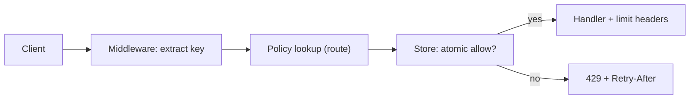
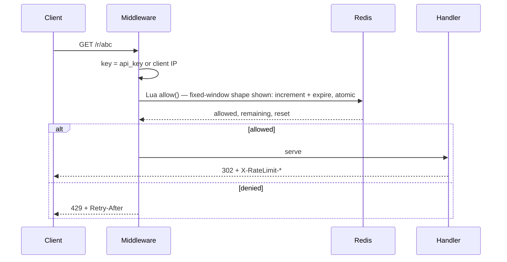
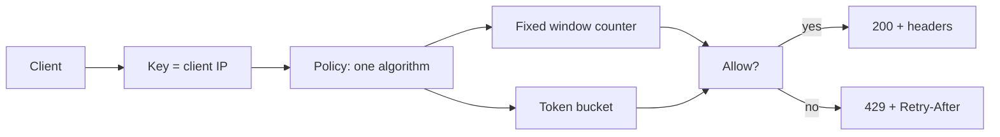
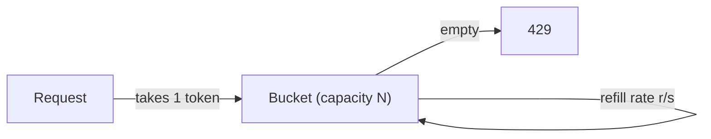
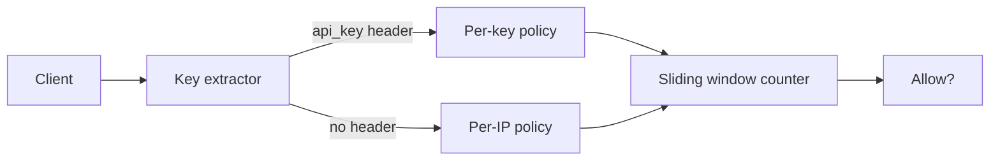
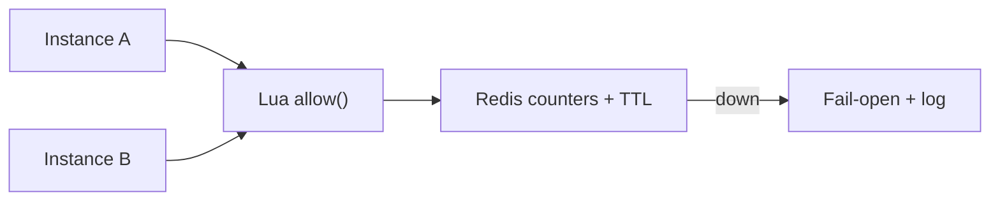
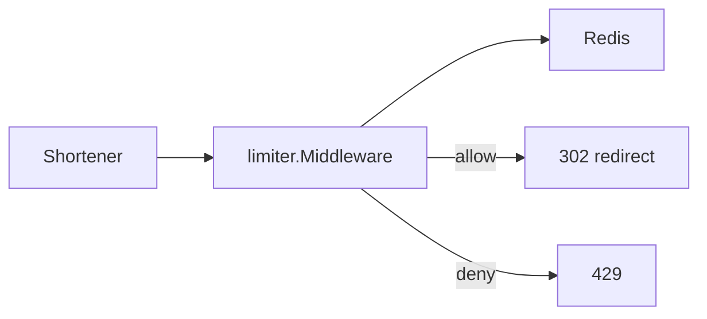
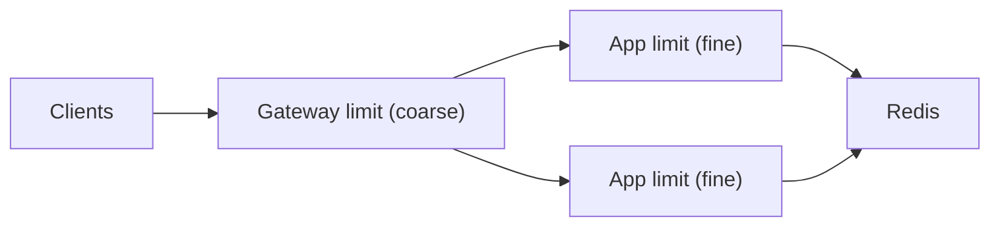

# Go Rate Limiter – System Design

A production-shaped rate limiter built in Go. This project focuses on **system design maturity** — algorithm trade-offs, shared state, fail-open vs fail-closed, and honest edge cases — rather than just a working demo.

**Live:** TBD

## Goal

Build a rate limiter that demonstrates real backend engineering judgment:

- Multiple algorithms with understood trade-offs, not one magic middleware
- Correct behavior under multi-instance deployment (shared state)
- Explicit failure semantics when the store is down
- A drop-in `net/http` middleware the URL shortener can actually import
- A simple, usable web interface — no JavaScript

## Requirements

### Functional

- Allow or deny a request against a named policy — window policies carry `{ limit, window }`, bucket policies carry `{ capacity, refill_per_sec }`, each tagged with its `algorithm`
- Per-IP and per-key policies, route-based selection
- Standard headers on every response: `X-RateLimit-Limit`, `X-RateLimit-Remaining`, `X-RateLimit-Reset`
- `429 + Retry-After` on deny
- Demo UI showing live bucket/counter state

### Non-Functional

- Single-digit millisecond overhead on the allow path
- Multi-instance safe: two processes never double-admit while the store is healthy
- Store outage degrades explicitly (fail-open with log, configurable to fail-closed)
- Memory bounded under adversarial key cardinality (eviction + TTL, never unbounded maps)

### Out of Scope (v1)

- Distributed consensus / custom gossip between instances (Redis is the shared state)
- Per-user quotas tied to billing (that's the Auth project's problem)
- Analytics dashboards beyond the demo UI
- User accounts / authentication (separate project)

## High-Level Architecture

```
Browser / Client
    │
    ▼
Go App Server (demo API + middleware, single process v1)
    │
    ├──► In-memory store (stages 1–2)
    │
    └──► Redis (stage 3+, shared counter state)
```

**Core principles:**

- The limiter is a decision function: `Allow(key) → (allowed, remaining, reset, retryAfter)`
- Counting must be atomic at the store — check-then-set in app code double-admits under concurrency
- The app server stays stateless in stage 3+: all counter state lives in Redis with TTLs
- Fail-open vs fail-closed is an explicit per-policy flag, not an accident

### Flow Charts

Request flow:



Middleware sequence:



## Design Evolution

Built in deliberate stages. Each stage is bare minimum shippable — no forward-building. Later stages swap the store, not the decision API.

### Stage 1 – In-Memory: Fixed Window + Token Bucket

Bare minimum to prove the decision function and the HTTP contract:

- Two algorithms: `fixed_window` (counter per key per tick) and `token_bucket` (refill-at-rate, burst to capacity)
- Single Go process, `sync.Mutex` + map with lazy expiry sweep
- Key = client IP only (no identity yet)
- One global policy per algorithm: fixed window takes `{ limit, window }`, token bucket takes `{ capacity, refill_per_sec }`
- Every response carries `X-RateLimit-Limit/Remaining/Reset`; denies carry `Retry-After`
- Unknown route → no limiting (middleware is opt-in per route)



Token bucket:



**Why these two first:** fixed window is the simplest correct thing (and its boundary-burst flaw is worth *seeing* before fixing); token bucket covers the burst-tolerant case your shortener's redirect path actually wants. Sliding window comes once the flaw hurts.

### Stage 2 – Policies: Sliding Window Counter, Per-Key + Per-IP

Bare minimum to handle real traffic shapes. No Redis yet — still single-instance:

- Third algorithm: `sliding_window_counter` (weighted blend of current + previous fixed window — approximate, O(1) memory per key)
- Policy model: named policies per route, each with `{ algorithm, ...params }` — `{ limit, window }` for windows, `{ capacity, refill_per_sec }` for buckets
- Key extractors: `api_key` header when present, else client IP — per-key policy wins, per-IP is the floor
- Key cardinality guard: LRU cap + TTL eviction on the in-memory map (adversarial IPs must not grow memory forever)
- Fixed-window boundary burst gets a failing test first, then the sliding counter fixes it



**Why sliding counter, not sliding log:** the log is exact but stores every timestamp — memory scales with traffic. The counter is O(1) per key and within one request of exact. At this scale, exactness isn't worth unbounded memory.

### Stage 3 – Shared State (Redis)

Bare minimum to survive two instances. The decision API doesn't change — only the store:

- Redis holds counters; all increments go through **Lua scripts** (atomic increment + TTL set in one round-trip, never check-then-set from Go)
- Token bucket in Redis: `tokens`, `last_refill` in a hash, refilled lazily inside the Lua script
- Sliding window counter in Redis: two keys (current + previous window) with TTLs
- Store outage semantics: **fail-open by default** (log + `allowed=true`, header `X-RateLimit-Fallback: true`) — a limiter that takes down the site is worse than a limiter that over-admits for 30 seconds. Per-policy `fail_closed: true` for routes where over-admit is unacceptable (e.g. login)
- Local short-circuit: tiny in-process negative cache? No — deliberate non-goal. Every decision hits Redis; added latency is measured and documented, not hand-waved



**Why Redis, and why Lua:** two processes with local maps double-admit — shared state is the whole point. Lua because the increment-check-expire must be one atomic step; three round-trips from Go reintroduce the race the middleware exists to prevent.

### Stage 4 – Middleware + Shortener Integration + UI

Bare minimum to be *used*, not just demoed:

- Published as importable `net/http` middleware: `limiter.Middleware(policyName, next)` — the shortener adds it to its redirect route in a few lines
- Policies live in config (env), not code: `POLICY_<name>_ALGO` plus `LIMIT/WINDOW` for windows or `CAPACITY/REFILL_PER_SEC` for buckets
- Demo UI (Go `html/template`, no JS): pick a policy, fire requests via form posts, watch remaining/reset update; a "burst" button that POSTs once while the *server* fans out N internal `Allow()` calls and renders all N outcomes — one POST, N decisions, no JS needed
- Deployed to Render; shortener's redirect route limited live



### Stage 5 – Future Scaling (Design Only)

- Redis Cluster / sharding by key hash
- Local token-bucket pre-filter to cut Redis QPS, reconciled asynchronously
- Gateway-level limiting (envoy/nginx) with app-level as second layer



## Key Design Decisions

### Algorithm Choice

| Algorithm | Memory | Exact? | Burst? | Use for |
| --------- | ------ | ------ | ------ | ------- |
| Fixed window | O(keys) | No (boundary burst) | No | Stage 1 learning, cheap global caps |
| Token bucket | O(keys) | N/A (rate, not window) | Yes (to capacity) | Shortener redirects, bursty reads |
| Sliding window counter | O(keys) | Approx (±1 req) | No | General API routes, login, write paths |

Deliberately excluded v1: sliding window log (memory scales with traffic), leaky bucket (smooths output — right for queues, wrong for admission control).

### Consistency Model

- Single-instance (stages 1–2): exact within the process, mutex-guarded
- Multi-instance (stage 3+): exact at Redis (Lua atomicity), at-least-once admit during fail-open windows — documented, measured, flagged per-policy

### Failure Handling

| Failure | Behavior |
| ------- | -------- |
| Limit exceeded | `429 + Retry-After: <seconds>`, counted as `rate_limited_total` |
| Redis down | Fail-open (allow + log + fallback header) unless policy says `fail_closed` |
| Key flood (cardinality attack) | LRU cap + TTL eviction; oldest idle keys dropped first |
| Clock skew | Stage 3+: windows derived from store time (Redis `TIME` inside Lua), never app clock. Stages 1–2 are single-process and use the wall clock — skew only matters once two instances share state |
| Duplicate counting on retry | Counting is server-side per request — client retries consume quota, by design |

## API Design

Middleware (Go, imported by the shortener):

```go
rl := ratelimit.New(store, policies)
mux.Handle("/r/", rl.Middleware("redirects", handler))
```

HTTP contract on every limited response:

```
X-RateLimit-Limit: 100
X-RateLimit-Remaining: 42
X-RateLimit-Reset: 1718035200
```

Denied:

```
HTTP/1.1 429 Too Many Requests
Retry-After: 17
X-RateLimit-Limit: 100
X-RateLimit-Remaining: 0
X-RateLimit-Reset: 1718035200
```

Demo endpoints:

```
POST /demo/request?policy=redirects&key=1.2.3.4  -> allow/deny + headers rendered as HTML
GET  /demo/state?policy=redirects&key=1.2.3.4   -> current remaining/reset
GET  /metrics                                   -> counters: rate_limited_total, fallback_allow_total
```

## Frontend

Server-rendered with Go's `html/template`, no JavaScript — same constraint as the shortener and worker pool:

- `GET /` — policy picker (dropdown), key input, "send request" + "burst ×20" buttons (plain form posts)
- Response panel showing allow/deny, remaining, reset countdown (via `<meta refresh>`)
- `GET /about` — project overview, same voice as the other two

## Implementation Status

| Stage | Status |
| ----- | ------ |
| In-memory fixed window + token bucket | Not started |
| Sliding window counter + per-key/per-IP policies | Not started |
| Redis shared state + fail-open semantics | Not started |
| Middleware + shortener integration + UI | Not started |
| Cluster / gateway layering | Designed only |
| Auth / billing quotas | Future project |

## Tech Stack

- **Language:** Go
- **Store:** in-memory (stages 1–2) → Redis, Upstash in production (stage 3+)
- **Frontend:** Go `html/template`, no JavaScript
- **Containerization:** Docker + Docker Compose
- **CI/CD:** GitHub Actions (format, vet, `go test -race` against real Redis service container, build)
- **Hosting:** Render

## Getting Started

```bash
git clone <repo-url>
cd go-rate-limiter-system-design
make compose-up
```

The app is available at `http://localhost:8080`.

See the `Makefile` for the full set of available commands (tests, formatting, linting, Docker).

## License

MIT
